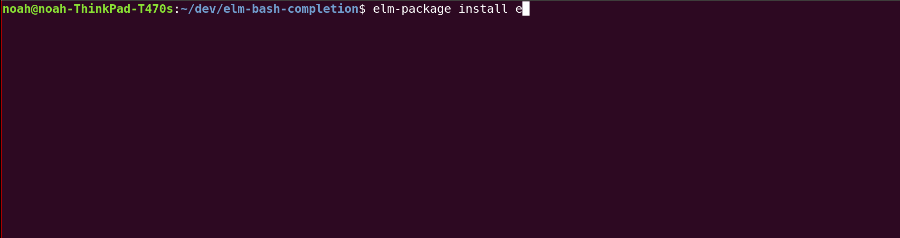

# elm-bash-completion

## Why?

Sometimes when you're installing a package and you know the name, it can be really nice to be able to hit tab a little earlier.

You might start typing and want things to expand 

```
elm-pa[TAB]
elm-package in[TAB]
elm-package install elm-co[TAB]
elm-package install elm-community/html-e[TAB]
```



## Installation


- Clone this repo
- Source the `_<command_name>.sh` files in your `~/.bashrc` or `~/.bash_profile`, using `source` 
- Restart bash or open a new terminal session

If you're using Linux, you probably want `.bashrc`. If you're using OS X, you probably want `.bash_profile`.

Example .bashrc or .bash_profile file:

```bash
for f in ~/dev/elm-bash-completion/_*; do source $f; done
```

## Oh My Zsh

Use `bashcompinit`.

```
autoload bashcompinit
bashcompinit
for f in ~/dev/elm-bash-completion/_*; do source $f; done
```
