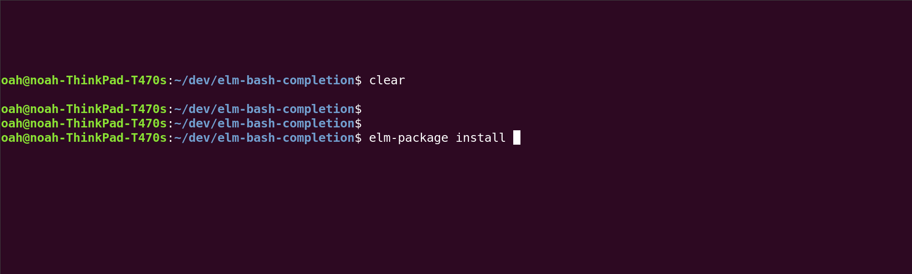

# elm-bash-completion

## Why?

Sometimes when you're installing a package and you know the name, it can be really nice to be able to hit tab a little earlier.

You might start typing and want things to expand 

```
elm-pa[TAB]
-> 
elm-package


elm-package in[TAB]
->
elm-package install 

elm-package install elm-co[TAB]
->
elm-package install elm-community/

elm-package install elm-community/html-e[TAB]
->
elm-package install elm-community/html-extra
```



## Installation


- Clone this repo
- Add a link to the `_elm_package.sh` file into your .bashrc. 

Example:

```bash
/ ~/dev/elm-bash-completion/_elm_package.sh
```